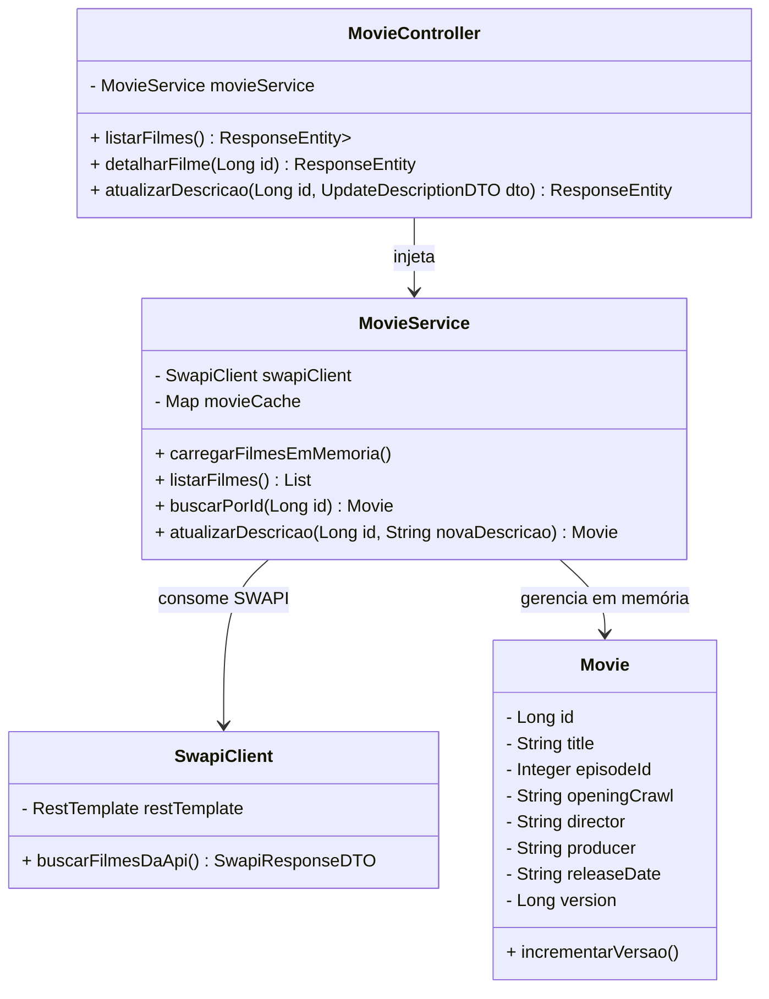

# Star Wars Movies Backend API

API REST desenvolvida em Java 17 com Spring Boot para gerenciar e consumir dados de filmes da saga Star Wars utilizando a SWAPI (The Star Wars API). O sistema carrega os filmes em memória ao iniciar, permitindo a listagem, detalhamento e atualização controlada de suas descrições com controle de versão incremental.

---

## 🛠️ Tecnologias Utilizadas

* **Java 17+**
* **Spring Boot** (Web, Rest, Actuator)
* **RestTemplate / WebClient** (Integração com a SWAPI)
* **Maven** (Gerenciamento de dependências)
* **JUnit 5 & Mockito** (Testes unitários e de integração)

---

## 📐 Diagrama UML

Abaixo está o diagrama de classes que representa a arquitetura e modelagem do domínio da aplicação.



---

## 🚀 Como Executar o Projeto

### Pré-requisitos
* **Java 17** ou superior instalado.
* **Maven** instalado (ou utilize o wrapper `./mvnw`).

### Passos para execução
1. Clone o repositório:
   ```bash
   git clone https://github.com/oliverafilipe/riachuelo-desafio-tecnico
   cd starwars-backend-challenge
   ```

2. Execute a aplicação utilizando o Maven:
   ```bash
   mvn spring-boot:run
   ```

3. A aplicação será iniciada na porta `8080` e fará o carregamento automático dos filmes da SWAPI em memória.

---

## 🔌 Endpoints da API

### 1. Listar Filmes
Retorna a lista de todos os filmes carregados em memória com suas respectivas versões e detalhes.
* **GET** `/api/movies`
* **Exemplo de Resposta:**
  ```json
  [
    {
      "id": 1,
      "title": "A New Hope",
      "episodeId": 4,
      "openingCrawl": "It is a period of civil war...",
      "director": "George Lucas",
      "producer": "Gary Kurtz, Rick McCallum",
      "releaseDate": "1977-05-25",
      "version": 1
    }
  ]
  ```

### 2. Detalhar Filme por ID
Exibe os detalhes de um filme específico pelo seu identificador.
* **GET** `/api/movies/{id}`

### 3. Atualizar Descrição do Filme
Atualiza a descrição (`openingCrawl`) de um filme específico em memória. O campo `version` é incrementado automaticamente a cada alteração.
* **PUT** `/api/movies/{id}/description`
* **Exemplo de Corpo da Requisição (JSON):**
  ```json
  {
    "openingCrawl": "Nova descrição épica para o filme Star Wars..."
  }
  ```
* **Exemplo de Resposta:**
  ```json
  {
    "id": 1,
    "title": "A New Hope",
    "episodeId": 4,
    "openingCrawl": "Nova descrição épica para o filme Star Wars...",
    "director": "George Lucas",
    "producer": "Gary Kurtz, Rick McCallum",
    "releaseDate": "1977-05-25",
    "version": 2
  }
  ```

---

## 🧪 Testes

Para executar os testes unitários e de integração implementados no projeto:

```bash
mvn test